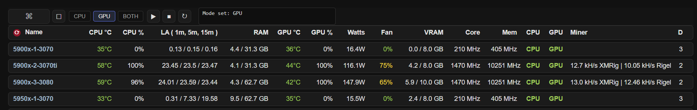
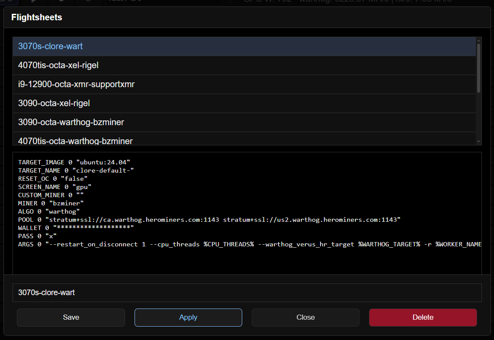
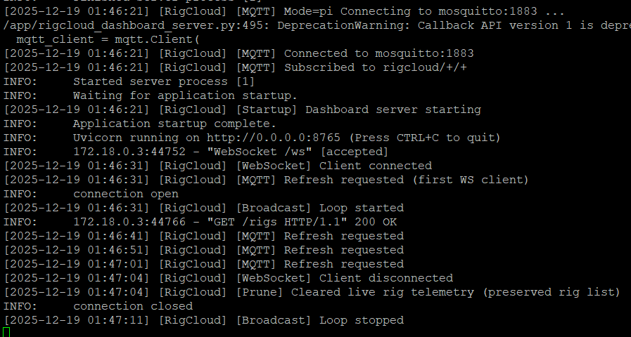

html Dashboard for ubuntu server rigs...

- added save/delete/apply 'flightsheet' using aws dynamodb
- create a iam profile with db access and save accessKeys.cvs in root of app
- click a row shows more details, click title hides row, click name to restore hidden 
- hold ctrl click rigname to select individual rows
- cpu / gpu services start, stop, restart, customisable in rigcloud_cmd.sh
- see run-a-miner-services.sh and run-a-miner-script.sh or
- https://github.com/greenfirn/Docker-Events/tree/main/source
- custom commands with reply, install miners, create files with tee echo etc
- index.html serves dashboard, customise colors etc in .css file
- working on more capabilities, design is just what chatgpt suggested for dark theme
- CPU temp, CPU Utl, LA, RAM, GPU temp, GPU UTL, GPU Watts, GPU Fan, VRAM, Core, Mem, CPU/GPU service, Containers running, Miners

** most recent files in repos **
- hashrates shown in dashboard:
- xmrig, bzminer, rigel, srbminer, lolminer, wildrig, onezerominer, gminer
- rigel shows miner and pool hashrate
- api settings need to be in cmd line,
- bzminer works by default
- see api-settings.txt
- in rigcloud_cmd.sh 'Both' is meant to start, stop, restart
- a 3rd CPU and GPU service but not using it

raspberry pi:
- mqtt, website host/backend
- some notes, config files in raspberry pi - docker

aws advanced setup:
- amazon web services has its own free tier mqtt service, in iot section
- requires unique certificates on website backend and all the mining/AI rigs
- duckdns or similar for connecting to your public ip
- caddy handles certificates, routing
- running server.py on aws lambda might be possible havnt looked into it yet

'flightsheet' 
- saves as text for now
- apply copies text over to send cmd and wraps it in tee EOF restart

server start, client connect, disconnect...
- timing could use some tweaking...
- rig names are preserved on browser restarts
- stats are collected on rigs only when webpage is active

developed with assistance from ChatGPT.
