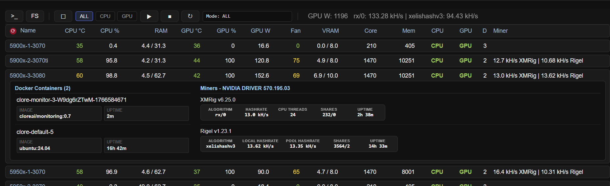
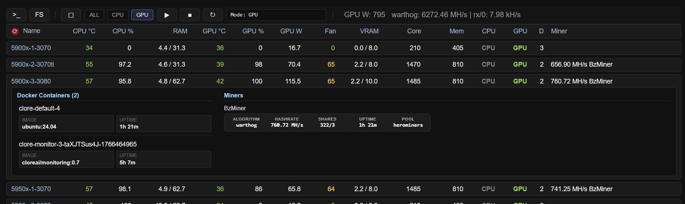
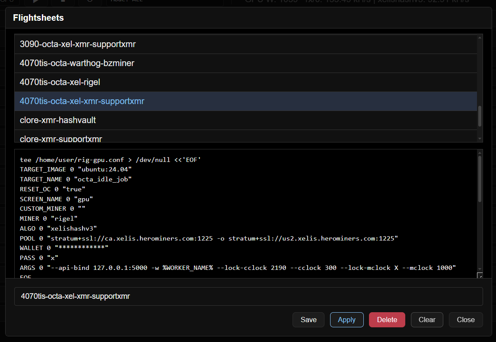

html Dashboard for ubuntu server rigs...

Rigel, XMRig...

Bzminer...

- click a row shows more details, click title hides row, click name to restore hidden 
- hold ctrl click rigname to select individual rows
- cpu / gpu services start, stop, restart, customisable in rigcloud_cmd.sh
- see run-a-miner-services.sh and run-a-miner-script.sh or
- https://github.com/greenfirn/Docker-Events/tree/main/source
- custom commands with reply, install miners, create files with tee echo etc
- index.html serves dashboard, customise colors etc in .css file
- working on more capabilities, design is just what chatgpt suggested for dark theme
- CPU temp, CPU Utl, LA, RAM, GPU temp, GPU UTL, GPU Watts, GPU Fan, VRAM, Core, Mem, CPU/GPU service, Containers running, Miners

** most recent files in repos **
- hashrate, accepted/rejected shares in dashboard:
- xmrig, bzminer, rigel, srbminer, lolminer, wildrig, onezerominer, gminer
- rigel shows miner and pool hashrate
- api settings need to be in cmd line, bzminer works by default
- see api-settings.txt
- save/delete/apply 'flightsheet' using aws dynamodb
- create a aws iam profile with db access and save accessKeys.cvs in root of app

'flightsheet' 
- saves as text for now
- apply copies text over to send cmd dialog

server start, client connect, disconnect...
- rig names are preserved on browser restarts
- stats are collected on rigs only when webpage is active
- timing could use some improvements...

developed with assistance from ChatGPT.com and chat.deepseek.com

if you find any part of this project useful...

☕ Buy me a coffee:
   ETH Address: `0xe65b5d7B7D43D77eF585CCF4a675832d0d23f806`

