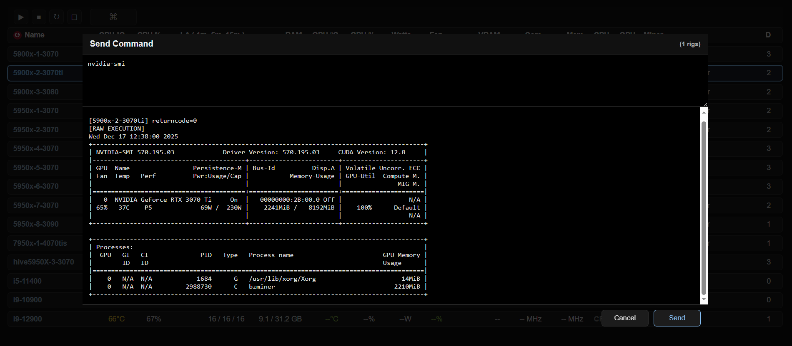

html Dashboard for ubuntu server / hiveos rigs... click a rig to show more details

CPU temp, CPU Utl, LA, RAM, GPU temp, GPU UTL, GPU Watts, GPU Fan, VRAM, Core, Mem, CPU/GPU service active, Miner, Containers running

rigs and dashboard backend talk to a MQTT Broker... can be run local on windows, raspberry pi, or amazon aws

... requires little setup just acts as a go between

rigcloud_dashboard_server.py connects to MQTT Broker as dashboard backend

'MOSQUITTO START' - remove this section from server.py if not on windows, and if from entry point

rigcloud_agent.py runs on rigs to collect stats on demand, accept commands, talks to MQTT Broker

raspberry pi setup - uses Docker, duckdns, caddy, mqtt, rigcloud_dashboard_server.py in a container

visual studio project files in repos to make development a little easier

setup notes for mosquitto-bridge mode in repos to use visual studio while rigs are still pointed at pi/aws

general cmds received by rigs get handled by rigcloud_cmd.sh

data hard reset, select buttons, and send command work for now, bzminer and xmrig hashrates

Some portions of this project were developed with assistance from ChatGPT.
